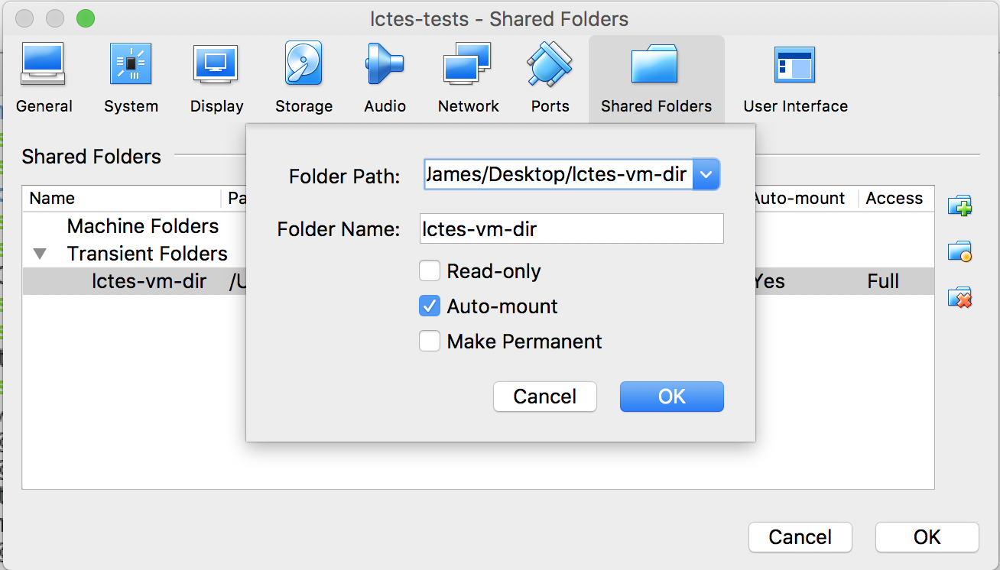

# Testing MakeCode and Codal

On this website, you will find the information required to reproduce our results gathered for the paper entitled "MakeCode and Codal: Intuitive and Efficient Embedded Systems Programming for Education" using the micro:bit. After reading the entirety of this page, at the top there is a drop down menu labelled `tests` which provides links to detailed documents on the tests we conducted for each environment using the micro:bit.

## Physical requirements

- Must have a micro:bit
- Must have a copy of our debian virtual machine with testing environment.
- Must have an oscilloscope available.

## Required ability
- Must be competent with debian, and terminal.
- Must have some experience with an oscilloscope, or are willing to learn how to use one!
- Understand how to use a serial terminal.

## Test procedure

Firstly, a virtual machine needs to be downloaded, steps to do this are described in the section entitled [Obtaining the virtual machine](#obtaining-the-virtual-machine).

Once you have obtained the virtual machine, the root directory for testing (`evaluators`) is arranged in the following form:

- `codal` contains the codal build environment which you will use to conduct codal tests.
- `docs` contains the documentation for tests and this overview document. We provide this website for convenience.
- `espruino` contains the espruino interpretter used when testing espruino.
- `makecode` contains a modified copy of the executable web editor that can be run locally.
- `tests` contains all of the tests, grouped by each environment, their use is described in the `docs` folder. e.g. `docs/codal.md` describes all tests that are contained in `tests/codal/*`.

Tests either use a serial terminal to validate output, or use an oscilloscope to measure waveforms, in either case the setup pictured below should be adequate for both tests:

The micro:bit is connected to a PC over USB (top of the micro:bit), which also exposes a serial port for a PC to connect to for serial output from the micro:bit. The scope has one probe lead connected to channel one, this probe lead connects to the micro:bit's ground pin (far right of the micro:bit), and samples pin P1 (yellow cable connected to the micro:bit). All tests use pin P1, so no reconfiguration of this setup will be required.

For information on how to use an oscilloscope we recommend this [sparkfun tutorial](https://learn.sparkfun.com/tutorials/how-to-use-an-oscilloscope/anatomy-of-an-o-scope#horizontal).

We provide minicom installed on the virtual machine to observe serial results. From a terminal run `minicom -D /dev/ttyACM0 -b 115200` to communicate with the microbit. `-D` specifies the device, and `-b` specifies the baud rate. Pasting into minicom (or more widely, a terminal window) is done through using `ctrl + shift + v`. To quit minicom, press `ctrl + a` followed by `q`.

## What is a micro:bit?

The [micro:bit](https://microbit.org) is a small embedded computer designed for computer science education, MakeCode and Codal were initially designed for the micro:bit, evolving and supporting other devices over time.

## Obtaining the virtual machine

The virtual machine is contained here in [google drive](https://drive.google.com/open?id=1nxiorz6NRqjen89G59RCOEMklqAyaUv7), freely downloadable by anyone. You will need to install the [VM VirtualBox Extension Pack](https://www.virtualbox.org/wiki/Downloads).

The virtual machine contains a folder named `evaluators` which is placed in the home directory of the lctes user. The username for the virtual machine is: `lctes` and the password is: `lctes2018`. To become super user, type su in a terminal, and enter the same password (`lctes2018`).

Once logged in, and in the `evaluators` directory, you can view the tests as markdown files in the `docs` directory. Alternately, these markdown documents can also be viewed on the web by running `mkdocs serve` in the evaluators folder, or browsing to: https://lancaster-university.github.io/lctes-artefact-evaluation/ which is a pre-built, and hosted version produced from the same source.

We recommend that you add the micro:bit usb device using the machine settings tab in virtual box as shown in the image below:

We also have a convenience script for mounting a shared folder between the host and the vm. Simply create a shared folder named `lctes-vm-dir` and run `sh mount.sh` (contained in `evaluators`) as a super user to mount the shared folder to vb-share (also contained in `evaluators`). Shared folder creation in VirtualBox is pictured below:

